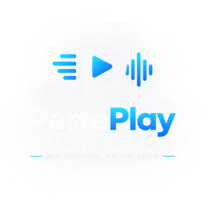
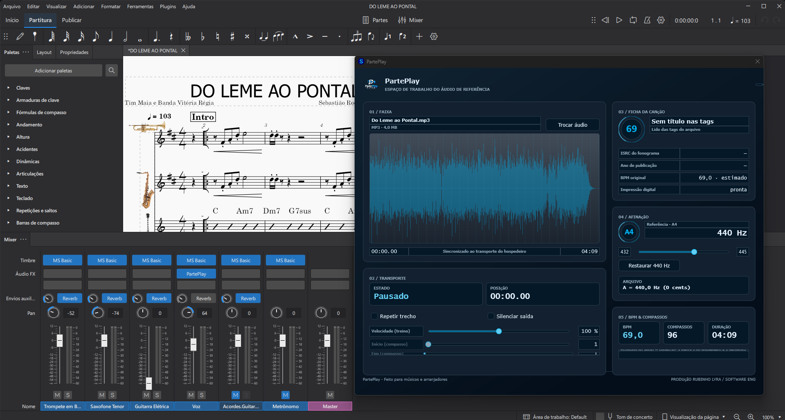

# PartePlay

[](CHANGELOG.md)
[](CMakeLists.txt)
[](https://github.com/rubenslyra/parteplay/actions/workflows/ci.yml)
[](Source/Plugin/PluginProcessor.cpp)
[](Source/Plugin/PluginProcessor.cpp)
[](Source/Audio/FilePlayer.cpp)
[](CMakeLists.txt)
[](CMakeLists.txt)
[](CMakePresets.json)
[](Tests/DomainTests.cpp)
[](Source/Ui/Text.cpp)
[](https://github.com/rubenslyra/parteplay/actions/workflows/ci.yml)
[](LICENSE)

A VST3 plugin that plays a **reference audio track in sync with the host transport** — so you
practice along with the real performance instead of a metronome. It works with MuseScore 4 or any
DAW, supports **training speed and bar-based looping**, computes a **local audio fingerprint**
(Chromaprint/AcoustID-compatible), and is **fully localized** in pt-BR, en-GB, en-US and es-ES.

**Version:** 0.2.2 · **Platform:** Windows 10/11, Ubuntu, macOS (CI-verified build matrix) · **Format:** VST3 · **Stack:** C++17 / JUCE 9.0.2 / CMake

<p align="center">
  
</p>

## Download

**v0.2.0-rc.1 — release candidate.** The plugin is free to download and test now, but it is still in
development: expect rough edges, and please [open an issue](https://github.com/rubenslyra/parteplay/issues/new/choose)
if something breaks. The stable release follows the RC once the feedback settles.

**[⬇ Download PartePlay VST3 — v0.2.0-rc.1](https://github.com/rubenslyra/parteplay/releases/tag/v0.2.0-rc.1)**

AGPL-3.0 · free and open-source · VST3 for Windows, Linux and macOS. The plugin is unsigned, so your
host will ask you to confirm it the first time you load it — see [Install](#install).



*PartePlay loaded as an effect in MuseScore 4, with the reference recording analysed and ready to
play in sync with the score.*

---

## The problem

When you study a piece you usually have a reference recording — but the performance moves forward
while you stop and restart. Re-aligning "a little ahead of the solo" is fragile and wastes practice
time.

PartePlay treats the reference audio as a **score follower that obeys the host clock**: the audio
position is derived from the transport (`timeInSamples`), so play, pause, seek, fast-forward and
rewind never drift from the score. It does **not** transpose or re-pitch the track — pitch handling
is limited to compensating the tuning reference against the tuning detected in the file.

## What it does today

- **Host-locked playback** — the audio follows the DAW/notation transport exactly; there is no
  internal clock to drift.
- **Tuning reference** — the plugin detects the tuning of the source file (Hz) and lets you set the
  reference (432–445 Hz, default A4 = 440 Hz). The playback ratio compensates the difference; it
  uses the original buffer when the ratio is exactly 1.0.
- **Training mode** — speed from 50% to 150% and a bar-based loop aligned to the detected meter,
  keeping playback in sync.
- **Tempo analysis** — detected BPM, meter (3/4 or 4/4), bar count and tuning, with **MIDI 1.0**
  time-map export for MuseScore and DAWs.
- **Offline fingerprint** — computes an AcoustID-compatible fingerprint locally (no cloud, no key
  embedded in the binary). Online lookup is intentionally disabled for now; see
  ["Identification"](#identification) below.
- **5:4 editor** — dark theme, waveform with visible loop markers, analysis tiles, stereo/mono
  output, and four locales selectable in the UI without restarting the host.

## Identification

The plugin fingerprints the loaded file **fully offline** (Chromaprint algorithm, 1.6.1, statically
linked) and shows the result state in the UI. Recording submissions and online matching are
deliberately **not** enabled in this release: it is a standalone product decision, not a technical
limitation. If and when they land, the AcoustID application key will come from the environment —
never from the binary.

## Requirements

- Windows 10/11, Ubuntu 24.04 or macOS 14+ (CI builds and tests all three, and
  produces a universal x86_64 + arm64 macOS bundle)
- Windows: Visual Studio 2022 Build Tools (workload *Desktop development with C++*);
  Linux/macOS: a C++17 toolchain plus the JUCE system packages
- CMake 3.22 or newer
- JUCE 9.0.2 — path via the `JUCE_ROOT` cache variable (default on Windows:
  `D:/Program Files/JUCE`; anywhere else it must be set, the build says so)
- For musical use: MuseScore 4 or any VST3-capable DAW

## Build

```powershell
cmake --preset msvc
cmake --build --preset msvc --config Release
```

Or the script (configure + build in one step):

```powershell
.\scripts\build.ps1 -Configuration Release
```

Artifact:

```
build/msvc/PartePlay_artefacts/Release/VST3/PartePlay.vst3
```

The presets also cover `ninja`, `linux`, `macos` and `macos-universal` (x86_64 + arm64).

## Tests

The domain and text layers have an automated suite (no UI, no audio thread) wired into CTest:

```powershell
cmake --build --preset msvc --config Release --target PartePlayTests
ctest --preset msvc
```

**325 checks, 0 failures.** The suite is organized so that musical correctness is enforced by code,
not by ear:

| Group                | What it locks                                                                                                                                              |
| -------------------- | ---------------------------------------------------------------------------------------------------------------------------------------------------------- |
| Tuning               | `Tuning::playbackRatio`, reference compensation (a 432 Hz file at a 440 Hz reference is ≈ +31.8 cents) and `NoteName` with octaves                         |
| Text encoding & i18n | `Text::from`/`Text::format` round-trips UTF-8 without double encoding; BCP 47 culture codes; `Text::number` decimal separators per locale                  |
| Song sheet strings   | Every UI string key resolves to content in all four locales; en-GB vs en-US spelling (`analysing`/`cancelled` vs `analyzing`/`canceled`) and es-ES accents |
| Fingerprint          | Chromaprint compute, stereo handling, rejections (empty / too short / unsupported formats), cancellation and async worker race rules                       |
| Player publication   | The audio buffer swap is lock-free (atomic `shared_ptr` publication); the race test fails if a lock is reintroduced                                        |

`install-vst3.ps1` runs this suite before installing and aborts on any failure
(`-SkipTests` to ignore).

## Install

The install scripts are PowerShell, so this section is Windows-only — the build
itself is cross-platform (see Requirements).

Close MuseScore (or the DAW) before installing — the binary is locked while the plugin is loaded.

```powershell
.\scripts\install-vst3.ps1
```

The script runs the domain tests, removes the previous install, copies the bundle to `C:\Program
Files\Common Files\VST3\PartePlay.vst3` and verifies the **SHA-256** of the installed binary against
the build. Requires an elevated shell.

The MuseScore notation template is installed separately:

```powershell
.\scripts\install-musescore-template.ps1
```

## Usage

1. Open MuseScore 4 and add PartePlay as an effect.
2. **Load audio** — WAV, FLAC, OGG or MP3.
3. Confirm the BPM, meter and bar count; export the MIDI time map if you want the DAW to match.
4. Set the **reference tuning** if your file is not A4 = 440 Hz (the plugin reports the detected
   tuning; a ratio of 1.0 plays the original buffer untouched).
5. Play: the track follows the host transport exactly.
6. To study: lower **training speed** and/or enable a **bar loop**.

## Parameters

| ID                      | Range / options             | Default |
| ----------------------- | --------------------------- | ------- |
| `referencePitch`        | 432.0 – 445.0 Hz (step 0.1) | 440.0   |
| `trainingSpeed`         | 0.50 – 1.50 (step 0.01)     | 1.00    |
| `loopEnabled`           | on / off                    | false   |
| `loopStart` / `loopEnd` | 1 – 10000 (bar)             | 1       |
| `muted`                 | silences local output       | false   |

All parameters are persisted in the host session and available for automation.

## Architecture

`Source/` is grouped by **module**, not by layer or by file type. Each folder answers one
question, and every file in it answers that question:

```
Source/
  Core/            identifiers and pure maths, with no JUCE and no host
    ParameterIds.h    — parameter identifiers (single source)
    Tuning.*          — music domain: reference notes, cents, playback ratio (single source)
  Audio/           the audio path
    FilePlayer.*      — loading, playback, loop, waveform peaks
    PitchShifter.*    — offline pitch-shift engine (isolated, replaceable; used only for
                        reference-vs-detected tuning compensation)
    Waveform.h        — min/max peak reduction, the data behind the waveform display
  Analysis/        what measures the file
    TempoAnalyser.*   — BPM, meter, bars and tuning detection
    FingerprintWorker.* — Chromaprint fingerprinting off the audio thread, async state machine
  Ui/              presentation
    Text.*            — i18n (pt-BR | en-GB | en-US | es-ES) and text interpolation
    Theme.h           — visual tokens and painting helpers
  Plugin/          the VST3 shell, the part the host sees
    PluginProcessor.* — parameters, host sync, playback pipeline
    PluginEditor.*    — the 5:4 editor (panels, LookAndFeel, layout, locale selector)
  Export/
    MidiMapExporter.* — MIDI 1.0 time-map export
Tests/
  DomainTests.cpp   — 325 checks: tuning, encoding, i18n, fingerprint, player publication
```

`Waveform.h` sits in `Audio/` and not in `Ui/`, because it is derived data — min/max pairs
over the decoded buffer — produced by `FilePlayer` and drawn by the editor. It is neither
one nor the other.

Every module folder is on the include path, so cross-module includes stay
`#include "Tuning.h"` with no path. The trade is explicit: the folder structure *documents*
the dependency direction, it does not enforce it. Enforcing it would mean a library target
per module, which for fourteen files is more scaffolding than code.

Structural decisions worth knowing:

- **Snapshot buffers** — the original and processed audio are immutable snapshots published through
  atomically swapped `shared_ptr<const>`; a parameter change never interrupts playback.
- **Every UI string goes through `Text::t`** — `juce::String::formatted` treats `%s` as `wchar_t*`
  on Windows, which is the root cause of broken accents. All interpolation goes through `Text`.
- **Music math lives in the domain** — `Tuning::playbackRatio` concentrates the ratio math in pure,
  testable code, outside the processor: the tuning gate is verified without a host and without ears.
- **No lock on the audio thread** — `processBlock` never takes a mutex; the file player swap is the
  lock-free publication that the race test locks down.

## Known limitations

- The phase vocoder degrades transients (percussive material) and can sound "washed" on long notes
  under large shifts.
- BPM, meter and tuning are **heuristics** — they are a reference for assembly; the host transport
  is always the truth. Automatic BPM does not re-align the score by itself yet.
- The track **does not appear** in MuseScore's instrument list; nothing is injected into the score.
- Direct transport injection is bounded by the VST3 API (Slave/Master relations) — hence the `.mid`
  time-map export.
- The audio path itself (sync under time-stretch, vocoder) has no automated tests and still relies
  on host validation.

## Documentation

- [`CHANGELOG.md`](CHANGELOG.md) — what changed, per release.
- [`DEBUG.md`](DEBUG.md) — opening the plugin in a host and reading the window data (`Ctrl+D` overlay,
  build and install, avoiding the stale-binary trap).
- [`CONTRIBUTING.md`](CONTRIBUTING.md) — conventions, test gate, code of conduct for PRs.
- [`THIRD_PARTY_NOTICES.md`](THIRD_PARTY_NOTICES.md) — the licences of every component
  statically linked into the binary, and the source offered for each.
- [`LICENSE`](LICENSE) — the AGPL-3.0 text.

## Contributing

Contributions are welcome — the full guide is in [`CONTRIBUTING.md`](CONTRIBUTING.md). The minimum:
run `ctest` before opening a PR, keep UTF-8 **with BOM** (that is a project decision, not an RFC
requirement), and route every UI string through `Text::t` in all four locales.

## License

**[AGPL-3.0](LICENSE)** — see the license file for the full text.

JUCE 9 is **dual-licensed**: AGPLv3 or the commercial JUCE licence. AGPL is more restrictive than
GPL — it also covers network use. If you need to close the source you must buy the commercial
licence; whether PartePlay ships a commercial edition is an open product decision (T-16).

---

## Author

**Rubens Lyra** — architecture and development of PartePlay.

| Area                         | What it involved                                                                                                                                                 |
| ---------------------------- | ---------------------------------------------------------------------------------------------------------------------------------------------------------------- |
| Software architecture        | Centralized music-domain model (`Tuning`, `ParameterIds`), replaceable engine seams, thread-safety decisions, feasibility analysis against real VST3 constraints |
| C++ / JUCE / audio DSP       | Phase vocoder, host-synced player, tempo analyser, offline fingerprint worker, JUCE editor                                                                       |
| VST3 / MuseScore integration | SDK contract, Slave/Master transport role, MIDI 1.0 time-map export, MuseScore 4 notation template                                                               |
| UI/UX & design system        | 5:4 editor redesign, token system (`Source/Ui/Theme.h`), panels, visual identity                                                                                    |
| Product, roadmap & docs      | Scope and prioritization, internationalization, handoff, this README                                                                                             |
| DevOps / build / release     | CMake presets, install scripts with hash verification, CTest suite, multi-platform CI                                                                            |

- GitHub: [github.com/rubenslyra/parteplay](https://github.com/rubenslyra/parteplay)
- LinkedIn: [linkedin.com/in/rubenslyra](https://www.linkedin.com/in/rubenslyra)

---

## References

### Standards in scope

| Standard                                                           | Scope in the project                                         |
| ------------------------------------------------------------------ | ------------------------------------------------------------ |
| **ISO 16:1975** — _Acoustics — Standard tuning frequency (440 Hz)_ | `Tuning::defaultReferenceHz = 440.0`, `Tuning::centsBetween` |
| **MIDI 1.0 — RP-001** (MMA / AMEI)                                 | The exported time-map file format in `MidiMapExporter`       |
| **VST3 SDK** (Steinberg)                                           | Plugin interface, transport contract, Slave/Master role      |
| **C++17** (ISO/IEC 14882:2017)                                     | `cxx_std_17`, no extensions                                  |

### Technical bibliography

- **JUCE 9.0.2** — _The JUCE Framework_. [Docs](https://docs.juce.com/master/) and
  [licensing](https://juce.com/legal/juce-9-licence/).
- **Laroche, J.; Dolson, M.** — "Improved phase vocoder time-scale modification of audio".
  _IEEE Trans. Speech and Audio Processing_, v. 7, n. 3, 1999 — phase propagation in `PitchShifter`.
- **Oppenheim, A. V.; Schafer, R. W.** — _Discrete-Time Signal Processing_. 3rd ed. Pearson,
  2010 — ch. 7–9: DFT, FFT, overlap-add block analysis.
- **Zwicker, E.; Fastl, H.** — _Psychoacoustics: Facts and Models_. 3rd ed. Springer, 2013 — the
  audibility range the pitch detector scans.

### Licensing

- **GNU AGPLv3** — section 13 covers remote (network) interaction; see the
  [JUCE licence](https://juce.com/legal/juce-9-licence/) for the commercial route.
- **Chromaprint** 1.6.1 (LGPL 2.1) — statically linked for the offline fingerprint. The source is
  committed at `Chromaprint-Dependences/chromaprint-1.6.1.tar.gz` and is never patched, so that
  archive *is* the source of the linked code. Full notices, including the FFmpeg-derived
  avresample and KissFFT, in [`THIRD_PARTY_NOTICES.md`](THIRD_PARTY_NOTICES.md).
