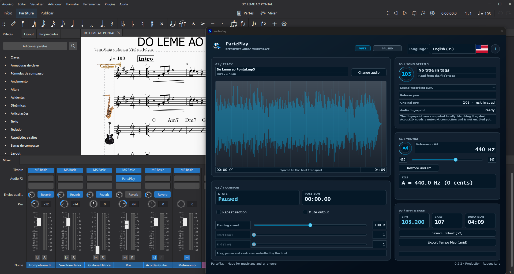

# PartePlay

[](CHANGELOG.md)
[](CMakeLists.txt)
[](https://github.com/rubenslyra/parteplay/actions/workflows/ci.yml)
[](Source/Plugin/PluginProcessor.cpp)
[](Source/Plugin/PluginProcessor.cpp)
[](Source/Audio/FilePlayer.cpp)
[](CMakeLists.txt)
[](CMakeLists.txt)
[](CMakePresets.json)
[](Tests/DomainTests.cpp)
[](Source/Ui/Text.cpp)
[](https://github.com/rubenslyra/parteplay/actions/workflows/ci.yml)
[](LICENSE)

A VST3 plugin that plays a **reference audio track in sync with the host transport** — so you
practice along with the real performance instead of a metronome. It works with MuseScore 4 or any
DAW, computes a **local audio fingerprint** (Chromaprint/AcoustID-compatible), and is **fully
localized** in pt-BR, en-GB, en-US and es-ES.

**Version:** 0.3.1 · **Prebuilt for:** Windows 10/11 and Ubuntu · **Also built and tested by CI for:** macOS 14+ (build from source) · **Format:** VST3 · **Stack:** C++17 / JUCE 9.0.2 / CMake

<p align="center">
  
</p>

## Download

**0.3.1 ships Windows and Linux binaries.** Each one was built and tested by CI on the same commit
the `v0.3.1` tag points at — that is the point of the packaging: the artifact you download is the
artifact the matrix compiled, not a rebuild from someone else's machine.

| Platform | Architecture | File |
|---|---|---|
| Windows | x86-64 | `PartePlay-0.3.1-win-x64.zip` |
| Linux | x86-64 | `PartePlay-0.3.1-linux-x64.zip` |

**[⬇ Download from the v0.3.1 release](https://github.com/rubenslyra/parteplay/releases/tag/v0.3.1)**

**No prebuilt macOS binary since 0.3.1.** CI still compiles and tests macOS and macOS universal on
every push — the bash 3.2 regression only shows up there — so macOS stays verified, it just is not
attached to the release. To get it, [build from source](#build); the presets and the install paths
are in [Install](#install). The `v0.3.0` release still carries the last macOS universal zip.

Every asset has a `.sha256` file, and the release carries a `SHA256SUMS.txt` covering all of them:

```bash
sha256sum -c SHA256SUMS.txt          # Linux
Get-FileHash .\PartePlay-0.3.1-win-x64.zip   # Windows
```

### Optional: the external tempo tools (Windows)

`PartePlay-0.3.0-tools-win-x64.zip` (~65 MB) is **separate on purpose**. It carries `ffmpeg` and
`soundstretch`, and it is the difference between the plugin running the SoundStretch tempo
analysis and running only the native analyser.

The plugin bundle is ~6.5 MB and does not contain these tools, so nobody pays a 65 MB download
for a feature that only some workflows use. Unpack it and drop the `bin` folder into either:

- `resources/bin` **next to the executable**, inside the installed bundle — that is
  `PartePlay.vst3\Contents\x86_64-win\resources\bin`; or
- `%APPDATA%\PartePlay\bin` — per-user, no admin rights, survives a reinstall of the plugin.

`PARTEPLAY_TOOLS_DIR` overrides both if you keep them somewhere else.

On Linux and macOS there is nothing to unpack: those `ffmpeg` and `soundstretch` builds are
Windows binaries, and the native analyser runs on its own there.

AGPL-3.0 — free and open-source — VST3 for Windows, Linux and macOS. The plugin is unsigned, so your
host will ask you to confirm it the first time you load it — see [Install](#install).



*PartePlay loaded as an effect in MuseScore 4, with the reference recording analysed and ready to
play in sync with the score.*

[▶ Watch the v0.3.0 demo](docs/screenshot-v0.3.0-release.mp4)

---

## The problem

When you study a piece you usually have a reference recording — but the performance moves forward
while you stop and restart. Re-aligning "a little ahead of the solo" is fragile and wastes practice
time.

PartePlay treats the reference audio as a **score follower that obeys the host clock**: the audio
position is derived from the transport (`timeInSamples`), so play, pause, seek, fast-forward and
rewind never drift from the score. It does **not** transpose or re-pitch the track — pitch handling
is limited to compensating the tuning reference against the tuning detected in the file.

## What it does today

- **Host-locked playback** — the audio follows the DAW/notation transport exactly; there is no
  internal clock to drift.
- **Tuning reference** — the plugin detects the tuning of the source file (Hz) and compensates it
  against a fixed A4 = 440 Hz reference. The playback ratio compensates the difference; it
  uses the original buffer when the ratio is exactly 1.0.
- **Training mode** — speed from 50% to 150% and a bar-based loop aligned to the detected meter,
  keeping playback in sync. Both parameters stay registered and automatable, but their editor
  controls are hidden in 0.3.1 (see [Parameters](#parameters)).
- **Tempo analysis** — detected BPM, meter (3/4 or 4/4), bar count and tuning, with **MIDI 1.0**
  time-map export for MuseScore and DAWs. An optional external pipeline (`ffmpeg` + SoundStretch,
  bundled under `resources/bin/`) refines the tempo with a different algorithm than the native
  analyser; the native `TempoAnalyser` is the default and the source of truth.
- **Leading-silence trim** — the reference track starts at its first non-zero sample instead of
  carrying the silence a lot of recordings open with, so playback does not sit behind the score.
- **Offline fingerprint** — computes an AcoustID-compatible fingerprint locally (no cloud, no key
  embedded in the binary). Online lookup is intentionally disabled for now; see
  ["Identification"](#identification) below.
- **5:4 editor** — dark theme, waveform with visible loop markers, analysis tiles, stereo/mono
  output, and four locales selectable in the UI without restarting the host.

## Identification

The plugin fingerprints the loaded file **fully offline** (Chromaprint algorithm, 1.6.1, statically
linked) and shows the result state in the UI. Recording submissions and online matching are
deliberately **not** enabled in this release: it is a standalone product decision, not a technical
limitation. If and when they land, the AcoustID application key will come from the environment —
never from the binary.

## Requirements

- Windows 10/11, Ubuntu 24.04 or macOS 14+ (CI builds and tests all three, and
  produces a universal x86_64 + arm64 macOS bundle)
- Windows: Visual Studio 2022 Build Tools (workload *Desktop development with C++*);
  Linux/macOS: a C++17 toolchain plus the JUCE system packages
- CMake 3.22 or newer
- JUCE 9.0.2 — path via the `JUCE_ROOT` cache variable (default on Windows:
  `D:/Program Files/JUCE`; anywhere else it must be set, the build says so)
- For musical use: MuseScore 4 or any VST3-capable DAW

## Build

The default preset is `msvc-2026` (Visual Studio 2026). If you only have the 2022
Build Tools, use the `msvc` preset instead — it is the same project, a different
toolchain path.

```powershell
cmake --preset msvc-2026
cmake --build --preset msvc-2026 --config Release
```

Or the script (configure + build in one step, same preset as the installer — mixing
presets between the two is how a stale plugin ends up in the host without anyone
noticing):

```powershell
.\scripts\build.ps1 -Configuration Release
```

Artifact:

```
build/msvc-2026/PartePlay_artefacts/Release/VST3/PartePlay.vst3
```

The configure presets cover `ninja`, `linux`, `macos` and `macos-universal`
(x86_64 + arm64). The binary bundle itself is platform-independent CMake —
`ExternalBpm` is the one deliberate exception, see [Known limitations](#known-limitations).

## Tests

The domain and text layers have an automated suite (no UI, no audio thread) wired into CTest:

```powershell
cmake --build --preset msvc-2026 --config Release --target PartePlayTests
ctest --preset msvc-2026 -C Release
```

**461 checks, 0 failures.** The suite is organized so that musical correctness is enforced by code,
not by ear:

| Group                | What it locks                                                                                                                                              |
| -------------------- | ---------------------------------------------------------------------------------------------------------------------------------------------------------- |
| Tuning               | `Tuning::playbackRatio`, reference compensation (a 432 Hz file at a 440 Hz reference is ≈ +31.8 cents) and `NoteName` with octaves                         |
| Text encoding & i18n | `Text::from`/`Text::format` round-trips UTF-8 without double encoding; BCP 47 culture codes; `Text::number` decimal separators per locale                  |
| Song sheet strings   | Every UI string key resolves to content in all four locales; en-GB vs en-US spelling (`analysing`/`cancelled` vs `analyzing`/`canceled`) and es-ES accents |
| Fingerprint          | Chromaprint compute, stereo handling, rejections (empty / too short / unsupported formats), cancellation and async worker race rules                       |
| Player publication   | The audio buffer swap is lock-free (atomic `shared_ptr` publication); the race test fails if a lock is reintroduced                                        |

`install-vst3.ps1` runs this suite before installing and aborts on any failure
(`-SkipTests` to ignore).

### What the VST3 load harness covers

The suite above tests the domain in isolation. A second, separate executable loads the
**published bundle** through `juce::VST3PluginFormatHeadless` — no GUI, no audio device — and
runs as a step of CI *after* packaging, because the bundle only exists once it is packaged:

```powershell
cmake --build build\msvc-2026 --config Release --target PartePlayHarness
.\build\msvc-2026\PartePlayHarness_artefacts\Release\PartePlayHarness.exe `
  .\build\msvc-2026\PartePlay_artefacts\Release\VST3\PartePlay.vst3
```

`$env:PARTEPLAY_HARNESS_VERBOSE = "1"` includes the plugin's own stdout. Exit `0` passes,
`5` means the negative case was rejected as intended, `99` is an unhandled exception.

The pipeline is configured to run it in four jobs — Windows, Ubuntu, macOS and macOS universal —
against the **extracted ZIP** rather than the build tree, so a packaging fault fails the build.
That configuration is new and has not yet run on all four platforms; Windows is the only one
verified so far.

| Layer                                              | Covered by                              | Automated? |
| -------------------------------------------------- | --------------------------------------- | ---------- |
| Musical domain, text, fingerprinting               | `ctest` (461 checks)                    | Yes        |
| The ZIP unzips to exactly one `PartePlay.vst3`     | load harness, in CI                     | Yes        |
| Bundle loads, instantiates, initialises, processes  | load harness, in CI                     | Yes        |
| A corrupt binary is rejected, not silently accepted | load harness, in CI                     | Yes        |
| Parameters are discovered and enumerated            | load harness, in CI                     | Yes        |
| The plugin survives the tempo tools being **absent** | load harness, in CI                     | Yes        |
| **Audio fidelity — sync under stretch, vocoder**   | —                                       | **No**     |
| **`locateTools()` actually finds ffmpeg/soundstretch** | —                                    | **No**     |
| **Tempo/MIDI sync inside a real host**             | —                                       | **No**     |
| **The plugin appears in MuseScore's instrument list** | —                                     | **No**     |

The last four are the reason a manual pass still matters. The harness proves the plugin
**loads and survives being told to process**; it cannot prove it sounds right, keeps time, finds
its external tools, or that MuseScore can see it. See [`DEBUG.md`](DEBUG.md) for the manual pass.

## Install

Close MuseScore (or the DAW) before installing — the binary is locked while the plugin is loaded.

### Windows

The install scripts are PowerShell, so the automated path is Windows-only. The bundle itself is
built and tested on all four CI targets.

```powershell
.\scripts\install-vst3.ps1
```

The script runs the domain tests, removes the previous install, copies the bundle to `C:\Program
Files\Common Files\VST3\PartePlay.vst3` and verifies the **SHA-256** of the installed binary against
the build. Requires an elevated shell.

The MuseScore notation template is installed separately:

```powershell
.\scripts\install-musescore-template.ps1
```

### Linux and macOS

There is no installer script yet — copy the bundle into the VST3 folder of the user. Copy the
`.vst3` **directory**, not the files inside it; a bundle with loose files at the root is not a
bundle and hosts will ignore it.

| Platform | Destination |
| --- | --- |
| Linux | `~/.vst3/PartePlay.vst3` |
| macOS (universal) | `~/Library/Audio/Plug-Ins/VST3/PartePlay.vst3` |

```bash
# Linux, after building with the `linux` preset
cp -R build/linux/PartePlay_artefacts/Release/VST3/PartePlay.vst3 ~/.vst3/

# macOS, after building with the `macos` preset (or `macos-universal` for x86_64 + arm64)
cp -R build/macos/PartePlay_artefacts/Release/VST3/PartePlay.vst3 ~/Library/Audio/Plug-Ins/VST3/
```

The plugin is **unsigned** on every platform, so the host asks you to confirm it the first time it
loads the bundle.

## Usage

1. Open MuseScore 4 and add PartePlay as an effect.
2. **Load audio** — WAV, FLAC, OGG or MP3.
3. Confirm the BPM, meter and bar count; export the MIDI time map if you want the DAW to match.
4. The plugin reports the detected tuning and compensates it against A4 = 440 Hz automatically (a
   ratio of 1.0 plays the original buffer untouched).
5. Play: the track follows the host transport exactly.
6. The transport panel offers **mute output**; play, pause and seek stay under host control.

## Parameters

| ID                      | Range / options             | Default | Editor control |
| ----------------------- | --------------------------- | ------- | -------------- |
| `referencePitch`        | 432.0 – 445.0 Hz (step 0.1) | 440.0   | hidden in 0.3.1 |
| `trainingSpeed`         | 0.50 – 1.50 (step 0.01)     | 1.00    | hidden in 0.3.1 |
| `loopEnabled`           | on / off                    | false   | hidden in 0.3.1 |
| `loopStart` / `loopEnd` | 1 – 10000 (bar)             | 1       | hidden in 0.3.1 |
| `muted`                 | silences local output       | false   | mute toggle |

All parameters are persisted in the host session and available for automation.

In 0.3.1 the bar loop, training speed and manual A4 reference have **no editor control**: they
never established a two-way link with the host transport, so the UI was withdrawn rather than
exposing a control that misleads. The parameters and the loop engine are kept intact on purpose,
so presets remain valid and the controls return in a later release once the host-side
implementation exists. Reach them by automation or by loading a state that already sets them.

## Coming next — sprint of 07/10/2026 to 28/10/2026

> **Heads-up:** work starts on **07/10/2026** and is planned for delivery at the **end of the
> sprint, on 28/10/2026**. None of this is in 0.3.1 — it targets **0.4.0**.

| Item | What it is | Why it is queued |
| --- | --- | --- |
| **Repeat with a real link to the host** | playhead, bar selection and loop written back to the score, in both directions | This is the defect 0.3.1 works around by removing the UI. The control cannot come back before this exists |
| **New version notice** | a manifest signed by CI and read from disk by the plugin | No token inside the VST3, no network required, works offline |

Until then the five parameters above stay registered and automatable, so nothing is lost while
the host-side work happens.

## Architecture

`Source/` is grouped by **module**, not by layer or by file type. Each folder answers one
question, and every file in it answers that question:

```
Source/
  Core/            identifiers and pure maths, with no JUCE and no host
    ParameterIds.h    — parameter identifiers (single source)
    Tuning.*          — music domain: reference notes, cents, playback ratio (single source)
  Audio/           the audio path
    FilePlayer.*      — loading, playback, loop, waveform peaks
    PitchShifter.*    — offline pitch-shift engine (isolated, replaceable; used only for
                        reference-vs-detected tuning compensation)
    Waveform.h        — min/max peak reduction, the data behind the waveform display
  Analysis/        what measures the file
    TempoAnalyser.*   — BPM, meter, bars and tuning detection
    FingerprintWorker.* — Chromaprint fingerprinting off the audio thread, async state machine
  Ui/              presentation
    Text.*            — i18n (pt-BR | en-GB | en-US | es-ES) and text interpolation
    Theme.h           — visual tokens and painting helpers
  Plugin/          the VST3 shell, the part the host sees
    PluginProcessor.* — parameters, host sync, playback pipeline
    PluginEditor.*    — the 5:4 editor (panels, LookAndFeel, layout, locale selector)
  Export/
    MidiMapExporter.* — MIDI 1.0 time-map export
Tests/
  DomainTests.cpp   — 461 checks: tuning, encoding, i18n, fingerprint, tempo, player publication
```

`Waveform.h` sits in `Audio/` and not in `Ui/`, because it is derived data — min/max pairs
over the decoded buffer — produced by `FilePlayer` and drawn by the editor. It is neither
one nor the other.

Every module folder is on the include path, so cross-module includes stay
`#include "Tuning.h"` with no path. The trade is explicit: the folder structure *documents*
the dependency direction, it does not enforce it. Enforcing it would mean a library target
per module, which for fourteen files is more scaffolding than code.

Structural decisions worth knowing:

- **Snapshot buffers** — the original and processed audio are immutable snapshots published through
  atomically swapped `shared_ptr<const>`; a parameter change never interrupts playback.
- **Every UI string goes through `Text::t`** — `juce::String::formatted` treats `%s` as `wchar_t*`
  on Windows, which is the root cause of broken accents. All interpolation goes through `Text`.
- **Music math lives in the domain** — `Tuning::playbackRatio` concentrates the ratio math in pure,
  testable code, outside the processor: the tuning gate is verified without a host and without ears.
- **No lock on the audio thread** — `processBlock` never takes a mutex; the file player swap is the
  lock-free publication that the race test locks down.

## Known limitations

- The phase vocoder degrades transients (percussive material) and can sound "washed" on long notes
  under large shifts.
- BPM, meter and tuning are **heuristics** — they are a reference for assembly; the host transport
  is always the truth. Automatic BPM does not re-align the score by itself yet.
- The track **does not appear** in MuseScore's instrument list; nothing is injected into the score.
- Direct transport injection is bounded by the VST3 API (Slave/Master relations) — hence the `.mid`
  time-map export.
- The bundled `ffmpeg` and `soundstretch` binaries in `resources/bin/` are **Windows builds**. The
  external tempo pipeline is therefore unavailable on Linux and macOS, where the native
  `TempoAnalyser` does the work on its own — which is the intended behaviour, not a defect. Tools
  can also be pointed elsewhere with the `PARTEPLAY_TOOLS_DIR` environment variable.
- The audio path itself (sync under time-stretch, vocoder) has no automated tests and still relies
  on host validation. The load harness proves the plugin loads, instantiates and processes, not
  that it sounds correct — see the coverage table under [Tests](#tests).

## Documentation

- [`CHANGELOG.md`](CHANGELOG.md) — what changed, per release.
- [`DEBUG.md`](DEBUG.md) — opening the plugin in a host and reading the window data (`Ctrl+D` overlay,
  build and install, avoiding the stale-binary trap).
- [`CONTRIBUTING.md`](CONTRIBUTING.md) — conventions, test gate, code of conduct for PRs.
- [`THIRD_PARTY_NOTICES.md`](THIRD_PARTY_NOTICES.md) — the licences of every component
  statically linked into the binary, and the source offered for each.
- [`LICENSE`](LICENSE) — the AGPL-3.0 text.

## Contributing

Contributions are welcome — the full guide is in [`CONTRIBUTING.md`](CONTRIBUTING.md). The minimum:
run `ctest` before opening a PR, keep UTF-8 **with BOM** (that is a project decision, not an RFC
requirement), and route every UI string through `Text::t` in all four locales.

## License

**[AGPL-3.0](LICENSE)** — see the license file for the full text.

JUCE 9 is **dual-licensed**: AGPLv3 or the commercial JUCE licence. AGPL is more restrictive than
GPL — it also covers network use. If you need to close the source you must buy the commercial
licence; whether PartePlay ships a commercial edition is an open product decision (T-16).

---

## Author

**Rubens Lyra** — architecture and development of PartePlay.

| Area                         | What it involved                                                                                                                                                 |
| ---------------------------- | ---------------------------------------------------------------------------------------------------------------------------------------------------------------- |
| Software architecture        | Centralized music-domain model (`Tuning`, `ParameterIds`), replaceable engine seams, thread-safety decisions, feasibility analysis against real VST3 constraints |
| C++ / JUCE / audio DSP       | Phase vocoder, host-synced player, tempo analyser, offline fingerprint worker, JUCE editor                                                                       |
| VST3 / MuseScore integration | SDK contract, Slave/Master transport role, MIDI 1.0 time-map export, MuseScore 4 notation template                                                               |
| UI/UX & design system        | 5:4 editor redesign, token system (`Source/Ui/Theme.h`), panels, visual identity                                                                                    |
| Product, roadmap & docs      | Scope and prioritization, internationalization, handoff, this README                                                                                             |
| DevOps / build / release     | CMake presets, install scripts with hash verification, CTest suite, multi-platform CI                                                                            |

- GitHub: [github.com/rubenslyra/parteplay](https://github.com/rubenslyra/parteplay)
- LinkedIn: [linkedin.com/in/rubenslyra](https://www.linkedin.com/in/rubenslyra)

---

## Acknowledgments

**Thiago Gonçalves** ([LinkedIn](https://www.linkedin.com/in/thiago-g/)) — unprompted
review and measurement across several releases.

- Read `release/0.2.2` and reported that the tuning correction was still routed
  through the vocoder, and that `exportTempoMap` writes the raw `getBpm()`. Both
  remain open and tracked.
- Measured the tuning error against carrier frequency at the 17-cent limit:
  100% at 2 kHz, 93% at 4 kHz, **0.9% at 6 kHz**. That measurement is what turned
  "the high end sounds wrong" into a defect locatable in the phase accumulator.
- Reported that an E♭ instrument transposed **+3 semitones instead of −9** — the
  same pitch class, the wrong octave, and it passed by ear. Fixed on 27/09/2026.
- Asked for the transposition table in interval-plus-octave form, tested per
  instrument. That is the format this project uses.

The 6 kHz measurement is the clearest case of what this project gains from
collaboration: a specific, falsifiable observation that decided what got
investigated next.

**An open question from the maintainer, sent to Thiago on 02/10/2026 — his reply is
not recorded here yet.** The 0.3.1 release withdraws the bar loop, training speed
and manual A4 controls from the editor. They never wrote back to the MuseScore
transport, so a control that looked live was not. The parameters and the loop
engine stay in place, and the plan for the sprint of 07/10/2026 to 28/10/2026 is
to make the Repeat genuinely bidirectional before those controls come back. That
design is the part worth arguing about: which way the round trip should go,
whether the bar selection belongs in the score or in the plugin, and what the
host exposes that is reliable enough to depend on. **Thiago — the transposition
table you asked for is already in interval-plus-octave form and tested per
instrument; if you can test the loop behaviour in 4.7.5 and tell me what the host
actually reports, that measurement decides the 0.4.0 design.**

---

## Credits and technologies

The same list is shown inside the plugin, behind the **i** button next to the language
selector, and it follows the active UI language.

**Audio libraries**

- **SoundTouch / SoundStretch** — open-source audio processing by Olli Parviainen
  (Finland); tempo and beat analysis. <https://www.surina.net/soundtouch/>
- **FFmpeg / FFprobe / libavcodec** — cross-platform multimedia system started by
  Fabrice Bellard in 2000; container and codec conversion. <https://ffmpeg.org/>
- **Chromaprint** — local acoustic fingerprinting. <https://acoustid.org/chromaprint>

**Interface and standards**

- **JUCE** — cross-platform C++ framework for audio plugins; architecture conceived by
  Julian "Jules" Storer. <https://juce.com/>
- **Steinberg VST3** (`IComponent` / `IEditController`) — plugin specification for
  real-time compatibility with audio hosts. <https://steinbergmedia.github.io/vst3_doc/>

**Build environment**

- Microsoft Visual Studio 2026 and Visual Studio Code, **C++17**.
  <https://visualstudio.microsoft.com/>

Every third-party component is listed, with its licence, in
[`THIRD_PARTY_NOTICES.md`](THIRD_PARTY_NOTICES.md). PartePlay itself is distributed
under the GNU AGPL-3.0.

---

## References

### Standards in scope

| Standard                                                           | Scope in the project                                         |
| ------------------------------------------------------------------ | ------------------------------------------------------------ |
| **ISO 16:1975** — _Acoustics — Standard tuning frequency (440 Hz)_ | `Tuning::defaultReferenceHz = 440.0`, `Tuning::centsBetween` |
| **MIDI 1.0 — RP-001** (MMA / AMEI)                                 | The exported time-map file format in `MidiMapExporter`       |
| **IEEE 754-2019** (ISO/IEC/IEEE 60559)                             | Double-precision BPM/cents (`TempoAnalyser`, `Tuning`); decimals in `Text::number` |
| **VST3 SDK** (Steinberg)                                           | Plugin interface, transport contract, Slave/Master role      |
| **C++17** (ISO/IEC 14882:2017)                                     | `cxx_std_17`, no extensions                                  |

### Technical bibliography

- **BPM and timing references** — consolidated in
  [`referencias_bibliograficas_bpm.md`](referencias_bibliograficas_bpm.md):
  MIDI 1.0/2.0, Roads (_The Computer Music Tutorial_), Huber/Runstein, IEEE 754,
  Boulanger/Lazzarini, the VST3 API and Campbell/Greated (cents vs. BPM).
- **JUCE 9.0.2** — _The JUCE Framework_. [Docs](https://docs.juce.com/master/) and
  [licensing](https://juce.com/legal/juce-9-licence/).
- **Laroche, J.; Dolson, M.** — "Improved phase vocoder time-scale modification of audio".
  _IEEE Trans. Speech and Audio Processing_, v. 7, n. 3, 1999 — phase propagation in `PitchShifter`.
- **Oppenheim, A. V.; Schafer, R. W.** — _Discrete-Time Signal Processing_. 3rd ed. Pearson,
  2010 — ch. 7–9: DFT, FFT, overlap-add block analysis.
- **Zwicker, E.; Fastl, H.** — _Psychoacoustics: Facts and Models_. 3rd ed. Springer, 2013 — the
  audibility range the pitch detector scans.

### Licensing

- **GNU AGPLv3** — section 13 covers remote (network) interaction; see the
  [JUCE licence](https://juce.com/legal/juce-9-licence/) for the commercial route.
- **Chromaprint** 1.6.1 (LGPL 2.1) — statically linked for the offline fingerprint. The source is
  committed at `Chromaprint-Dependences/chromaprint-1.6.1.tar.gz` and is never patched, so that
  archive *is* the source of the linked code. Full notices, including the FFmpeg-derived
  avresample and KissFFT, in [`THIRD_PARTY_NOTICES.md`](THIRD_PARTY_NOTICES.md).
